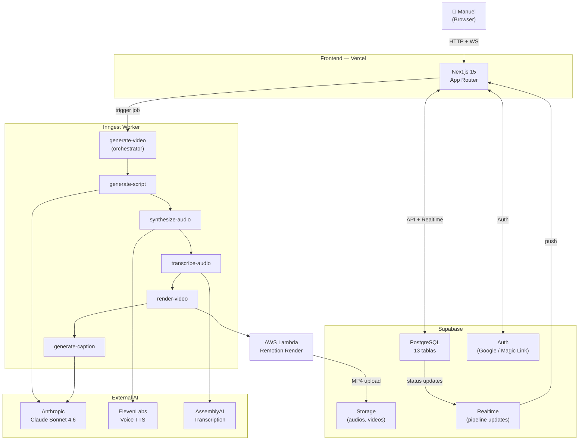

# Architecture Overview

Resumen high-level del sistema Virus. Para entender cómo encajan todas las piezas antes de tocar código.

Para decisiones técnicas detalladas, ver [prompts/00-ARCHITECTURE.md](../prompts/00-ARCHITECTURE.md).

---

## El problema que resuelve

Crear contenido de video de forma consistente requiere:

1. Ideas frescas que no repitan lo mismo
2. Scripts calibrados para formato corto
3. Voz propia (no texto a pantalla)
4. Captions sincronizados
5. Video renderizado en el formato correcto para cada plataforma

Hacerlo manualmente toma horas. Virus automatiza el 90%: vos solo revisás y publicás.

---

## Diagrama del sistema



---

## Pipeline de estados

Cada video pasa por 8 estados. Cada estado = un job de Inngest.

```
pending
  ↓
scripting     ← Claude genera hook + script (25 words/segmento max)
  ↓
audio         ← ElevenLabs sintetiza narración con tu voz clonada
  ↓
captioning    ← AssemblyAI transcribe con timestamps word-level
  ↓
rendering     ← Remotion renderiza en AWS Lambda (H264, 1080×1920, 30fps)
  ↓
captioning_text ← Claude escribe captions para Reels / TikTok / Shorts
  ↓
ready         ← Video disponible para descargar
  ↓
published     ← Manuel lo marcó como publicado
```

Duración total: **5–10 minutos** por video (dominado por render en Lambda).

---

## Monorepo — paquetes

```
virus/
├── apps/
│   ├── web/          Next.js 15 — dashboard + API routes
│   └── worker/       Inngest functions — 8 funciones de pipeline
│
├── packages/
│   ├── db/           Supabase schema, 13 migraciones, TypeScript types
│   ├── remotion/     7 templates de video (React components)
│   ├── shared/       Clientes AI, engine viral, audio, captions, render
│   └── inngest/      Definiciones de eventos + tipos compartidos
│
├── infra/
│   └── remotion-lambda/   Scripts de deploy a AWS Lambda
│
└── prompts/          48 prompts para agentes Claude (construcción del sistema)
```

### `@virus/web`

Dashboard en Next.js 15 (App Router). Maneja:
- Auth (Google OAuth + magic link vía Supabase)
- CRUD de proyectos y videos
- UI del pipeline (Kanban)
- Calendar y batch generation
- Settings (voz, brand, pilares)
- API routes (`/api/generate`, `/api/inngest`, `/api/voice`, etc.)

### `@virus/worker`

Funciones de Inngest que corren en background. Las 8 funciones principales:

| Función | Hace |
|---------|------|
| `generate-video-project-aware` | Orquestador: lee patrones del proyecto, aplica anti-repeat, decide hook+topic+format |
| `generate-script` | Claude escribe el script completo (segmentos de 25 palabras max) |
| `synthesize-audio` | ElevenLabs TTS con el Voice ID configurado |
| `transcribe-audio` | AssemblyAI transcribe para captions sincronizados |
| `render-video` | Llama a Lambda con el template + assets, espera el MP4 |
| `generate-caption` | Claude escribe caption para cada plataforma |
| `handle-failure` | Recovery de errores — re-enqueue o marca como failed |
| `parse-project-file` | Parsea archivos viral_patterns + project_info (md/json/pdf/imagen) |

### `@virus/shared`

Librería de utilidades compartida entre web y worker:

- `ai/` — cliente Anthropic con caching, tipos de modelos, 4 prompts tipados
- `audio/` — cliente ElevenLabs, post-processing, voice config
- `captions/` — AssemblyAI, mapper de segmentos, fallback a Whisper
- `render/` — cliente Lambda, tipos de render
- `viral/` — el engine principal (ver abajo)

### `@virus/db`

Schema de Supabase. 13 migraciones, RLS habilitado en todas las tablas.

Tablas clave:

| Tabla | Propósito |
|-------|-----------|
| `projects` | Contenedor multi-proyecto por usuario |
| `project_files` | Archivos subidos (viral_patterns, project_info) |
| `project_patterns` | Patrones parseados (JSONB) |
| `project_brand` | Info de marca parseada (JSONB) |
| `videos` | Estado completo del pipeline + progreso de render |
| `video_performance` | Métricas por plataforma (views, likes, etc.) |
| `project_used_signatures` | Hashes anti-repeat (ventana de 14 días) |
| `viral_hooks_seed` | Catálogo público de 30 hooks por defecto |

### `@virus/remotion`

7 templates de video como componentes React:

| Template | Formato | Duración |
|----------|---------|----------|
| `tip` | Consejo rápido | 30–45s |
| `hot-take` | Opinión contrarian | 12–18s |
| `speed-build` | Demo de código rápido | 20–30s |
| `listicle` | Lista numerada | 45–60s |
| `story` | Arco narrativo | 30–45s |
| `comparison` | A vs B | 40–60s |
| `hello` | Placeholder | — |

Safe zones: top 250px, bottom 350px (UI de Instagram/TikTok).

---

## Viral Engine

El corazón del sistema. Está en `packages/shared/src/viral/`.

**Cómo funciona:**

1. **Parser** — lee el archivo `viral_patterns.md` del proyecto. Extrae hooks, formatos, temas, cadencia, CTAs, hashtags. Funciona con md, json, pdf, o imagen.

2. **Suggestion algorithm** — combina hook + topic + format de forma que:
   - Maximiza variedad (no repite el mismo ángulo)
   - Respeta la distribución 60/30/10 de pilares de contenido
   - Sugiere el template de Remotion apropiado para el formato

3. **Anti-repeat** — antes de confirmar una sugerencia, hashea `hook + topic + angle` y chequea contra `project_used_signatures`. Bloquea repeticiones de los últimos 14 días (hooks) / 7 días (topics).

**Por qué importa:** Podés tener proyectos de distintos nichos (dev, fitness, finanzas) y el engine funciona igual para todos — solo hay que subir el archivo `viral_patterns` correcto para cada proyecto.

---

## Multi-proyecto

El sistema soporta múltiples proyectos por usuario. Cada proyecto tiene:

- Su propio `viral_patterns.md/json/pdf` (los patrones virales del nicho)
- Su propio `project_info.md/json/pdf` (descripción, audiencia, voz, value props)
- Historial de videos aislado
- Anti-repeat propio (14 días)
- Voice ID opcional (puede compartir un clone o tener uno por proyecto)
- Color de tema propio

Esto permite manejar, por ejemplo, una cuenta de dev y una de marketing desde la misma instancia de Virus.

---

## Decisiones técnicas clave

Documentadas en detalle en [prompts/00-ARCHITECTURE.md](../prompts/00-ARCHITECTURE.md). Resumen:

| Decisión | Alternativa descartada | Razón |
|----------|----------------------|-------|
| Inngest para jobs | Bull/BullMQ, SQS | Free tier generoso, DX excelente, retry built-in |
| Remotion en Lambda | ffmpeg manual, Creatomate | Control total sobre el template, TypeScript puro |
| AssemblyAI para captions | Whisper local | Timestamps word-level más precisos, sin infraestructura |
| Supabase Realtime | Polling | Updates de pipeline instantáneos sin código adicional |
| pnpm + Turborepo | Nx, Lerna | Velocidad, simplicidad, caché de build |

---

## Flujo de datos — generar un video

```
1. Usuario aprueba una idea en /dashboard/ideas
   → POST /api/generate { videoId }

2. API route crea el video en Supabase (estado: pending)
   → Inngest event: virus/idea.approved

3. Inngest: generate-video-project-aware
   → Lee viral_patterns del proyecto
   → Aplica anti-repeat
   → Decide hook + topic + format + template
   → Actualiza video (estado: scripting)

4. Inngest: generate-script
   → Claude Sonnet 4.6 escribe script (segmentos de 25 palabras)
   → Guarda script en videos.script_json

5. Inngest: synthesize-audio
   → ElevenLabs TTS con ELEVENLABS_VOICE_ID
   → Sube audio a Supabase Storage
   → Actualiza videos.audio_url

6. Inngest: transcribe-audio
   → AssemblyAI transcribe con word-level timestamps
   → Guarda captions en videos.captions_json

7. Inngest: render-video
   → Llama a AWS Lambda con template + script + audio + captions
   → Remotion renderiza H264 1080×1920 MP4
   → Sube a Supabase Storage
   → Actualiza videos.video_url (estado: captioning_text)

8. Inngest: generate-caption
   → Claude escribe captions para Reels, TikTok, Shorts
   → Guarda en videos.captions_text (estado: ready)

9. Usuario descarga el video y el caption desde /dashboard/pipeline
```

---

## Costo estimado mensual

| Servicio | Costo |
|----------|-------|
| Supabase | $0–25 |
| Vercel | $0 (Hobby) |
| AWS Lambda | ~$5–10 |
| ElevenLabs | $22 (Creator) |
| Anthropic | ~$5–15 |
| AssemblyAI | ~$2 |
| Inngest | $0 (free tier) |
| **Total** | **~$35–75/mes** |

El costo escala linealmente con la cantidad de videos. 1 video/día = ~$45/mes.
