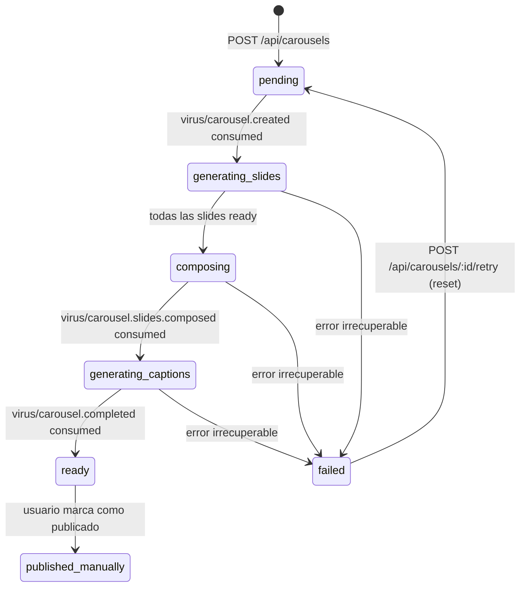

# ADR — Carril de Carruseles de Instagram

**Estado:** Aceptado  
**Fecha:** 2026-05-09  
**Autor:** Manuel Navarro (APEX)  
**Scope:** Carril paralelo al pipeline de videos — no toca ningún archivo existente del carril de videos.

---

## Goal y non-goals

**Goal:** Agregar a Virus la capacidad de generar carruseles de Instagram de 8 slides (imágenes + overlay de texto + caption) de forma automática, reutilizando el client de Gemini 2.5 Flash Image, la info de marca (`project_brand`) y los patrones virales (`project_patterns`) ya disponibles por proyecto. El usuario solo ingresa un brief corto; el sistema genera imágenes, compose el overlay, propone 3 variantes de caption y deja todo listo para descargar y publicar manualmente.

**Non-goals (v1):** publicación automática a Instagram, scheduling, A/B test de captions en plataforma, multi-idioma (solo `es-AR`), slide count configurable por el usuario (fijo en 8), aspect ratio configurable (fijo 4:5), generación de video/Reels desde el carrusel.

---

## Data model

### Convenciones heredadas del proyecto

- `user_id` denormalizado vía trigger `set_project_user_id()` — RLS directo sin JOIN.
- `TEXT + CHECK` en vez de ENUMs (online migrations sin lock).
- JSONB para estructuras complejas; columnas tipadas para campos indexados.
- NO `storage_url` en tablas — signed URLs generados on-demand.
- `deleted_at` para soft delete en la tabla principal.

### `carousel_projects`

```sql
CREATE TABLE public.carousel_projects (
  id            uuid        PRIMARY KEY DEFAULT gen_random_uuid(),
  project_id    uuid        NOT NULL REFERENCES public.projects(id) ON DELETE CASCADE,
  user_id       uuid        NOT NULL REFERENCES public.profiles(id) ON DELETE CASCADE,
  status        text        NOT NULL DEFAULT 'pending'
                              CHECK (status IN (
                                'pending',
                                'generating_slides',
                                'composing',
                                'generating_captions',
                                'ready',
                                'published_manually',
                                'failed'
                              )),
  brief         text        NOT NULL,
  slide_count   int         NOT NULL DEFAULT 8,
  style_preset  text        NOT NULL DEFAULT 'bold'
                              CHECK (style_preset IN ('bold', 'minimal', 'editorial')),
  error         text,
  inngest_run_id text,
  deleted_at    timestamptz,
  created_at    timestamptz NOT NULL DEFAULT NOW(),
  updated_at    timestamptz NOT NULL DEFAULT NOW()
);

CREATE INDEX carousel_projects_user_idx  ON public.carousel_projects (user_id);
CREATE INDEX carousel_projects_proj_idx  ON public.carousel_projects (project_id);
CREATE INDEX carousel_projects_status_idx ON public.carousel_projects (user_id, status);

-- trigger: copy user_id from projects on INSERT
CREATE TRIGGER copy_user_id_carousel_projects
  BEFORE INSERT ON public.carousel_projects
  FOR EACH ROW EXECUTE FUNCTION set_project_user_id();

-- trigger: updated_at
CREATE TRIGGER set_carousel_projects_updated_at
  BEFORE UPDATE ON public.carousel_projects
  FOR EACH ROW EXECUTE FUNCTION update_updated_at_column();
```

### `carousel_slides`

Una fila por slide. `idx` es 0-based (0–7 para 8 slides).

```sql
CREATE TABLE public.carousel_slides (
  id            uuid        PRIMARY KEY DEFAULT gen_random_uuid(),
  carousel_id   uuid        NOT NULL REFERENCES public.carousel_projects(id) ON DELETE CASCADE,
  user_id       uuid        NOT NULL REFERENCES public.profiles(id) ON DELETE CASCADE,
  idx           int         NOT NULL CHECK (idx >= 0),
  prompt        text        NOT NULL,
  image_path    text,                    -- storage path en bucket 'carousels'; NULL hasta que se genera
  composed_path text,                    -- storage path post-overlay; NULL hasta compose
  overlay_text  text,                    -- texto de overlay para este slide
  status        text        NOT NULL DEFAULT 'pending'
                              CHECK (status IN ('pending', 'generating', 'ready', 'failed')),
  error         text,
  created_at    timestamptz NOT NULL DEFAULT NOW(),
  updated_at    timestamptz NOT NULL DEFAULT NOW(),
  UNIQUE (carousel_id, idx)
);

CREATE INDEX carousel_slides_carousel_idx ON public.carousel_slides (carousel_id);
CREATE INDEX carousel_slides_carousel_idx_idx ON public.carousel_slides (carousel_id, idx);

-- trigger: updated_at
CREATE TRIGGER set_carousel_slides_updated_at
  BEFORE UPDATE ON public.carousel_slides
  FOR EACH ROW EXECUTE FUNCTION update_updated_at_column();
```

> **Nota sobre user_id en slides:** `set_project_user_id()` lee `project_id` de la fila. Las slides no tienen `project_id` directo, así que necesitan su propio trigger que lea `user_id` desde `carousel_projects` via `carousel_id`. Ver migración para la función `set_carousel_slide_user_id()`.

### `carousel_captions`

Tres variantes de caption por carrusel. `variant_idx` 0–2.

```sql
CREATE TABLE public.carousel_captions (
  id           uuid        PRIMARY KEY DEFAULT gen_random_uuid(),
  carousel_id  uuid        NOT NULL REFERENCES public.carousel_projects(id) ON DELETE CASCADE,
  user_id      uuid        NOT NULL REFERENCES public.profiles(id) ON DELETE CASCADE,
  variant_idx  int         NOT NULL CHECK (variant_idx >= 0 AND variant_idx <= 2),
  text         text        NOT NULL,
  framework    text        NOT NULL CHECK (framework IN ('aida', 'pas', 'hook_story_cta')),
  selected     boolean     NOT NULL DEFAULT false,
  created_at   timestamptz NOT NULL DEFAULT NOW(),
  UNIQUE (carousel_id, variant_idx)
);

CREATE INDEX carousel_captions_carousel_idx ON public.carousel_captions (carousel_id);
```

### RLS

```sql
ALTER TABLE public.carousel_projects   ENABLE ROW LEVEL SECURITY;
ALTER TABLE public.carousel_slides     ENABLE ROW LEVEL SECURITY;
ALTER TABLE public.carousel_captions   ENABLE ROW LEVEL SECURITY;

CREATE POLICY carousel_projects_owner ON public.carousel_projects
  FOR ALL USING (user_id = auth.uid()) WITH CHECK (user_id = auth.uid());

CREATE POLICY carousel_slides_owner ON public.carousel_slides
  FOR ALL USING (user_id = auth.uid()) WITH CHECK (user_id = auth.uid());

CREATE POLICY carousel_captions_owner ON public.carousel_captions
  FOR ALL USING (user_id = auth.uid()) WITH CHECK (user_id = auth.uid());
```

---

## Storage

### Bucket

```sql
INSERT INTO storage.buckets (id, name, public, file_size_limit, allowed_mime_types)
VALUES (
  'carousels',
  'carousels',
  false,                  -- NO public CDN; signed URLs on-demand
  10485760,               -- 10 MB por archivo (PNG 4:5 ≈ 2–4 MB)
  ARRAY['image/png', 'image/jpeg', 'image/webp']
);
```

### Path layout

```
{user_id}/{carousel_id}/slide-{idx}.png        # imagen raw de Gemini
{user_id}/{carousel_id}/composed-{idx}.png     # imagen post-overlay (Satori+Sharp)
```

### Policies

Mismo patrón que los buckets existentes: ownership check vía subquery contra `carousel_projects`:

```sql
CREATE POLICY "carousels_storage_select"
  ON storage.objects FOR SELECT TO authenticated
  USING (
    bucket_id = 'carousels'
    AND (storage.foldername(name))[2] IN (
      SELECT id::text FROM public.carousel_projects
      WHERE user_id = (SELECT auth.uid())
    )
  );
-- INSERT / DELETE análogos, WITH CHECK en INSERT.
```

> El segundo folder (índice 2) es el `carousel_id` — el primero es `user_id`. Mismo patrón de `(storage.foldername(name))[1]` que usan los buckets de videos/audio, ajustado al segmento correcto.

### Signed URLs

- Dashboard preview: 7 días (al listar slides).
- Export ZIP: 1 hora (one-shot).
- NO se guardan URLs en la DB — se regeneran on-demand.

---

## Eventos Inngest

Todos con prefijo `virus/carousel.` para mantener namespace limpio y separado de `virus/` (videos).

```typescript
// En packages/inngest/src/client.ts — ampliar el tipo Events:

'virus/carousel.created':           { data: { carouselId: string; userId: string; projectId: string } };
'virus/carousel.slides.composed':   { data: { carouselId: string } };
'virus/carousel.caption.requested': { data: { carouselId: string } };
'virus/carousel.completed':         { data: { carouselId: string } };
'virus/carousel.failed':            { data: { carouselId: string; step: string; error: string } };
```

> **Por qué solo 5 eventos (no 7):** El progreso per-slide (antes `virus/carousel.slide.generated`) se comunica vía Supabase Realtime actualizando `carousel_slides.status`, no como evento Inngest — emitir un evento por slide desde dentro de un `step.run()` va contra el modelo de Inngest y añade ruido innecesario al event log. El evento `virus/carousel.brief.ready` fue descartado porque el parsing del brief y la generación de slides ocurren en la misma función (`generate-carousel-slides.ts`) usando `step.run()` internos; no hay necesidad de un evento intermediario.

### Flujo de eventos

```
POST /api/carousels
  → crea carousel_projects (status: pending)
  → emite virus/carousel.created

virus/carousel.created
  → generate-carousel-slides: lee brand+patterns, construye prompts
  → llama Gemini 8× (paralelo con step.run por slide)
  → sube cada imagen a Storage
  → actualiza carousel_slides[idx] (status: ready, image_path)
  → emite virus/carousel.slides.composed (si todos OK)
     o virus/carousel.failed (si alguno falla y no hay retry)

virus/carousel.slides.composed (nombre: "slides listas para compose")
  → compose-carousel-overlay: Satori+Sharp, overlay de texto por slide
  → sube composed-{idx}.png
  → actualiza carousel_slides[idx] (composed_path)
  → emite virus/carousel.caption.requested

virus/carousel.caption.requested
  → generate-carousel-caption: Claude escribe 3 variantes (AIDA, PAS, Hook-Story-CTA)
  → inserta en carousel_captions
  → emite virus/carousel.completed

virus/carousel.completed
  → actualiza carousel_projects.status = 'ready'
  → Supabase Realtime notifica al browser

virus/carousel.failed
  → actualiza carousel_projects.status = 'failed', .error
  → Supabase Realtime notifica al browser
```

---

## State machine



**Transiciones válidas:**

| Desde | Hacia | Disparador |
|-------|-------|-----------|
| `pending` | `generating_slides` | `virus/carousel.created` |
| `generating_slides` | `composing` | todas slides en `ready` |
| `generating_slides` | `failed` | error en Inngest |
| `composing` | `generating_captions` | `virus/carousel.slides.composed` |
| `composing` | `failed` | error en Inngest |
| `generating_captions` | `ready` | `virus/carousel.completed` |
| `generating_captions` | `failed` | error en Inngest |
| `failed` | `pending` | retry manual vía API |
| `ready` | `published_manually` | acción manual del usuario |

---

## API surface (`apps/web`)

### Endpoints

| Método | Path | Descripción | Response |
|--------|------|-------------|----------|
| `POST` | `/api/carousels` | Crea carousel + despacha evento | `201 { carouselId }` |
| `GET` | `/api/carousels` | Lista carouseles del user (RLS filtra) | `200 { carousels[] }` |
| `GET` | `/api/carousels/[id]` | Detalle con slides + captions | `200 { carousel, slides[], captions[] }` |
| `POST` | `/api/carousels/[id]/retry` | Reset a `pending` desde último step OK | `202 { carouselId }` |
| `POST` | `/api/carousels/[id]/slides/[idx]/regenerate` | Regenera una slide específica | `202` |
| `POST` | `/api/carousels/[id]/captions/[variant]/select` | Marca caption como seleccionado | `200` |
| `GET` | `/api/carousels/[id]/export` | Stream ZIP con slides compuestas | `200 application/zip` |

### `POST /api/carousels` — lógica

```
1. requireUser() — auth check
2. Validar body: { projectId, brief, stylePreset? }
3. Verificar ownership del proyecto (project.user_id = auth.uid())
4. Pre-flight: project_brand.is_current existe (igual que /api/generate)
5. INSERT carousel_projects (status: pending)
6. inngest.send('virus/carousel.created', { carouselId, userId, projectId })
7. return 201 { carouselId }
```

### Autenticación

Mismo patrón que el carril de videos: `createClient()` del servidor, `auth.getUser()`, admin client para writes.

---

## Web routes (`apps/web`)

| Path | Propósito |
|------|-----------|
| `/(dashboard)/dashboard/carousels` | Lista de carouseles |
| `/(dashboard)/dashboard/carousels/new` | Form de creación (brief + proyecto + style preset) |
| `/(dashboard)/dashboard/carousels/[id]` | Vista de detalle, preview de slides, selección de caption, export |

Todas bajo el layout `/(dashboard)` existente (auth guard + nav).

---

## Worker functions (`apps/worker/src/functions/`)

| Archivo | Trigger | Hace |
|---------|---------|------|
| `generate-carousel-slides.ts` | `virus/carousel.created` | Orquestador: lee brand+patterns, construye 8 prompts, llama Gemini en paralelo (step.run por slide), sube imágenes, emite `virus/carousel.slides.composed` o `virus/carousel.failed` |
| `compose-carousel-overlay.ts` | `virus/carousel.slides.composed` | Satori renderiza el overlay de texto por slide; Sharp convierte a PNG; sube `composed-{idx}.png`; emite `virus/carousel.caption.requested` |
| `generate-carousel-caption.ts` | `virus/carousel.caption.requested` | Claude Sonnet 4.6 escribe 3 captions (AIDA, PAS, Hook-Story-CTA) usando brand.voice_tone + brief; inserta en `carousel_captions`; emite `virus/carousel.completed` |
| `handle-carousel-failure.ts` | `onFailure` de las 3 funciones | Actualiza `carousel_projects.status = 'failed'`, guarda error, emite `virus/carousel.failed` |

### Patrón de resiliencia por slide (en `generate-carousel-slides.ts`)

Igual que `generate-visual-assets.ts`: cada slide corre en su propio `step.run('generate-slide-{idx}')`. Un slide que falla retorna `null` y el resto continúa. Si ≥1 slides quedan en `failed`, se emite `virus/carousel.failed` al final (no se avanza a composing con slides faltantes).

---

## Shared module (`packages/shared/src/carousel/`)

| Archivo | Exports clave |
|---------|--------------|
| `types.ts` | `CarouselProject`, `CarouselSlide`, `CarouselCaption`, `CarouselStatus`, `StylePreset` |
| `prompts.ts` | `buildSlidePrompts(brief, brand, patterns, stylePreset): string[]` — 8 prompts de imagen |
| `prompts.ts` | `buildCaptionPrompt(brief, brand, slides, framework): string` — prompt para Claude |
| `templates.ts` | Definiciones de `StylePreset` (bold / minimal / editorial): paleta, tipografía, layout de overlay |
| `composer.ts` | `composeSlide(imageBytes, overlayText, template): Promise<Buffer>` — Satori+Sharp |
| `cost.ts` | `estimateCarouselCost(slideCount): number` — estimación en USD antes de generar |

### Extensión del tipo `GeminiGenInput`

El client actual (`packages/shared/src/visuals/providers/gemini.ts`) acepta `'9:16' | '1:1'`. Los carruseles IG usan **4:5 (1080×1350)**. En la migración de código se extenderá el tipo:

```typescript
aspectRatio?: '9:16' | '4:5' | '1:1';
// y en dimensionsFor():
case '4:5': return [1080, 1350];
```

Esto no rompe el carril de videos (que siempre pasa `'9:16'`).

---

## Decisiones clave

| Decisión | Alternativa descartada | Porqué |
|----------|----------------------|--------|
| **Gemini 2.5 Flash Image** para slides | Imagen 4 Fast (Vertex AI) | Gemini ya tiene client en el repo, no requiere allowlist de Vertex, API pública. Imagen 4 Fast requiere aprobación por proyecto en Vertex AI y aumenta la deuda de infra. |
| **Inngest** para orquestación | Trigger.dev, BullMQ | Ya está en el repo. Retry built-in, memoización de steps, DX excelente, free tier. Cambiar generaría fricción con cero beneficio. |
| **Satori + Sharp** para overlay | Puppeteer + Chrome headless | Sin headless browser: menos RAM, más rápido en Lambda/Node, no requiere instalar Chrome. Satori genera SVG desde JSX en Node puro; Sharp convierte a PNG con aceleración nativa. |
| **Slide count fijo en 8** | Configurable por el usuario | 8 es el sweet spot de engagement en IG 2025-2026 (suficiente para narrar, poco para perder swipes). Simplifica la UX y la estimación de costo. Se puede hacer configurable en v2. |
| **Aspect ratio fijo 4:5** | 1:1 o configurable | 4:5 maximiza espacio en el feed IG sin ser Stories. Fijarlo en v1 simplifica el modelo y los templates de overlay. |
| **3 variantes de caption** | 1 sola | Permite elegir el tono (urgente vs. educativo vs. narrativo) sin overhead de generación extra (son ~500 tokens en total). |
| **Captions en Claude Sonnet 4.6** | GPT-4o, Gemini Flash texto | Mismo modelo que el resto del pipeline. Reutiliza el client Anthropic existente con caching. |
| **ZIP export server-side** | Links individuales | Un solo click descarga las 8 composed slides + el caption seleccionado. Mejor UX para publicar desde mobile. |
| **`published_manually`** en vez de integración IG API | Graph API de Instagram | La API de Instagram requiere Business Account verificada + aprobación de Meta. Para v1, Manuel publica manualmente. |

---

## Out of scope — v1

- Publicación automática vía Instagram Graph API.
- Scheduling (programar publicación a una hora).
- A/B test de captions con métricas de plataforma.
- Multi-idioma (solo `es-AR` en v1).
- Slide count configurable por el usuario.
- Aspect ratio configurable (solo 4:5).
- Animación / video de los slides (Reels desde carrusel).
- Anti-repeat para carruseles (puede agregarse en v2 si hay señal de que el usuario genera mucho volumen).

---

## Riesgos y mitigaciones

| Riesgo | Probabilidad | Impacto | Mitigación |
|--------|-------------|---------|-----------|
| Rate limit de Gemini con 8 generaciones paralelas | Media | Medio | `step.run` por slide; retries con backoff exponencial de Inngest. En generación paralela, limitar concurrencia del worker a 3 (`concurrency: { limit: 3 }` en función Inngest). |
| Texto de overlay demasiado largo para el template | Alta | Bajo | `composer.ts` trunca el texto con `...` si supera el límite del template y loguea warning. El usuario puede regenerar el slide. |
| Gemini rechaza prompt por política RAI | Baja | Medio | El `step.run` del slide captura el error, setea `carousel_slides[idx].status = 'failed'`, y el orquestador emite `virus/carousel.failed`. El usuario puede editar el brief y hacer retry. |
| Costo imprevisto si se generan muchos carruseles | Baja | Alto | `cost.ts` estima el costo antes de llamar a Gemini. En la API `POST /api/carousels`, mostrar estimación al usuario (similar al spend cap del pipeline de videos). En v2, agregar daily cap. |
| Sharp/Satori con dependencias nativas en Vercel Edge | Media | Alto | Las funciones de worker corren en Node.js (no Edge). `compose-carousel-overlay.ts` va en el worker (`apps/worker`), no en web. Sharp y Satori son compatibles con Node.js serverless estándar. |
| ZIP de 8 PNGs puede superar timeout de Vercel (30s) | Baja | Medio | Generar el ZIP en el worker como step separado y guardar en Storage; el endpoint `/export` retorna una signed URL de 1h al ZIP, no lo genera en-flight. |

---

## Cost model

| Componente | Costo unitario | Por carrusel (8 slides) |
|-----------|---------------|------------------------|
| Gemini 2.5 Flash Image (Nano Banana) | $0.04 / imagen | $0.32 |
| Claude Sonnet 4.6 — captions (3 variantes, ~600 tokens out) | ~$0.018 / 1K tokens out | ~$0.011 |
| Supabase Storage | ~$0.021 / GB / mes | despreciable (8 PNG ≈ 20 MB) |
| Inngest | $0 (free tier) | $0 |
| **Total estimado** | | **~$0.33 por carrusel** |

> El costo de $0.04/imagen está tomado del valor en `packages/shared/src/visuals/providers/gemini.ts` (línea 35), actualizado a 2026-05. Se lo puede revisar si Nano Banana actualiza precios.

---

## Checklist de consistencia

- [x] Nombres de tablas: `carousel_projects`, `carousel_slides`, `carousel_captions` — no colisionan con ninguna tabla existente.
- [x] Prefijo de eventos: `virus/carousel.*` — no colisiona con `virus/idea.*`, `virus/script.*`, etc.
- [x] Rutas API: `/api/carousels/...` — no colisiona con `/api/generate`, `/api/inngest`, `/api/voice`.
- [x] Routes web: `/(dashboard)/dashboard/carousels/...` — bajo el mismo layout guard existente.
- [x] Bucket: `carousels` — no colisiona con `project-files`, `videos`, `audio`, `thumbnails`, `visual-assets`.
- [x] Funciones worker: `generate-carousel-slides`, `compose-carousel-overlay`, `generate-carousel-caption`, `handle-carousel-failure` — no colisionan con las 8 funciones existentes.
- [x] Shared module: `packages/shared/src/carousel/` — no colisiona con `ai/`, `audio/`, `captions/`, `render/`, `viral/`, `visuals/`.
- [x] Extensión de `GeminiGenInput.aspectRatio` es backward-compatible (nuevo valor opcional).
